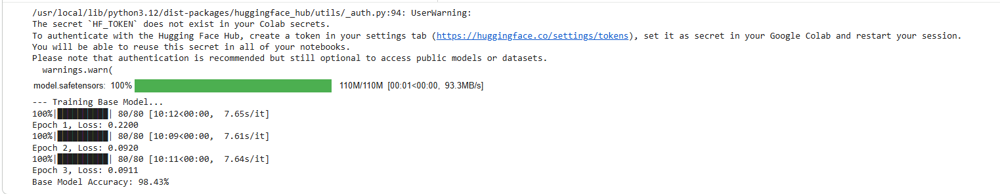
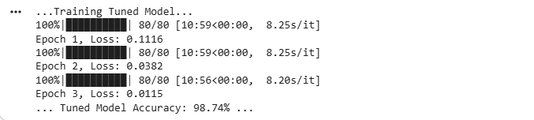
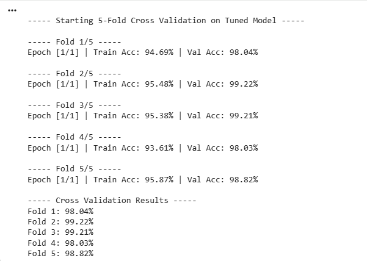
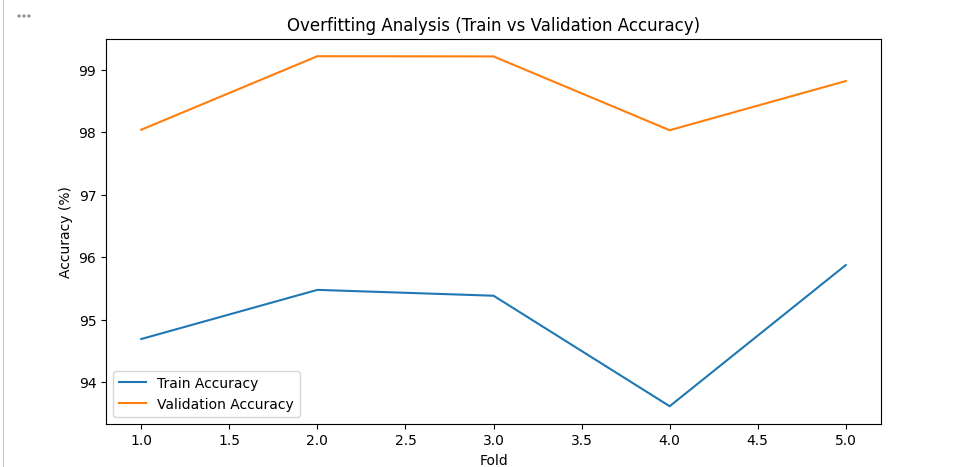
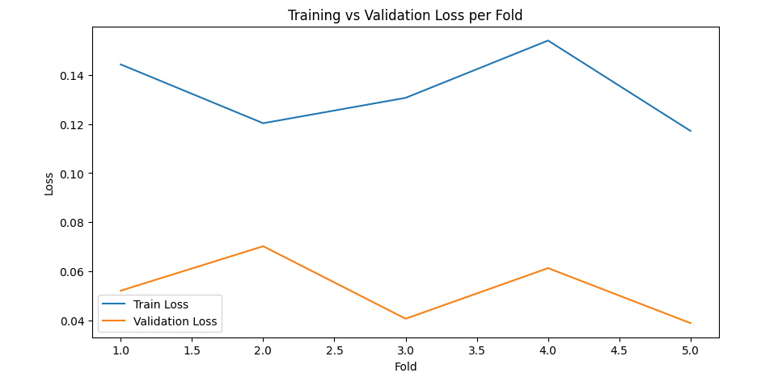
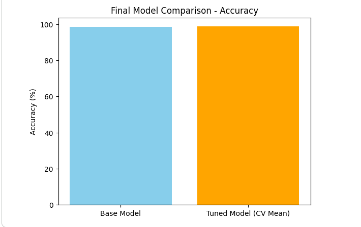
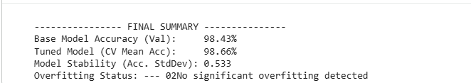

# Vehicle Classification Using ResNeSt50

## Project Overview
This project uses Deep Learning and Transfer Learning with ResNeSt50 to classify vehicle images into two categories:

- Cars
- Motorcycles

## Dataset

The dataset contains vehicle images categorized into:

- Cars
- Motorcycles

The dataset was used for educational and research purposes.

## Project Results

The model was trained using Transfer Learning with ResNeSt50.

Key achievements:

- Vehicle image classification
- Transfer Learning implementation
- Performance evaluation
- Deep Learning workflow using PyTorch
  
  ## Results

### Training Base Model

### Training Tuned Model

### Cross Validation Results

### Training vs Validation Accuracy

### Training vs Validation Loss

### Final Model Comparison Accuracy

### Final Summary

  
## Technologies Used
- Python
- PyTorch
- Google Colab
- ResNeSt50
- Deep Learning

## Features
- Image Classification
- Transfer Learning
- 5-Fold Cross Validation
- Performance Evaluation

## Author
Adini Utthara
Information Systems Engineering Undergraduate
SLIIT
